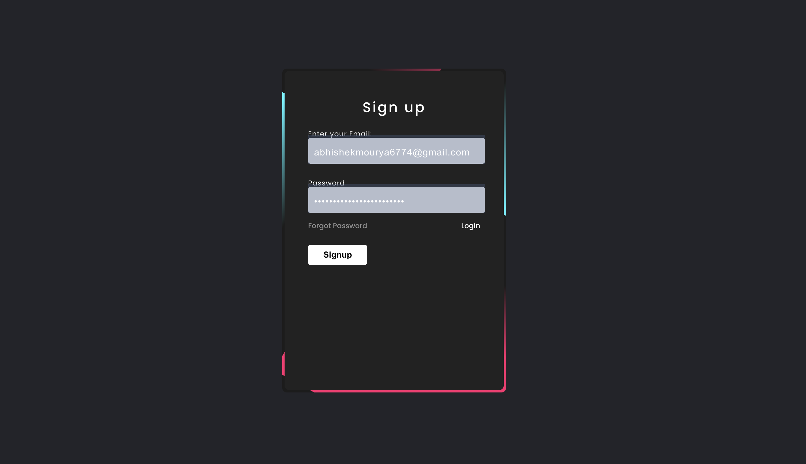
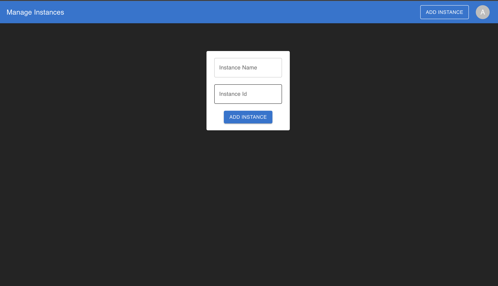
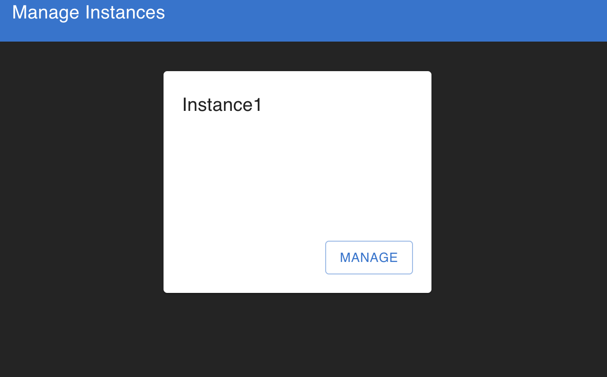
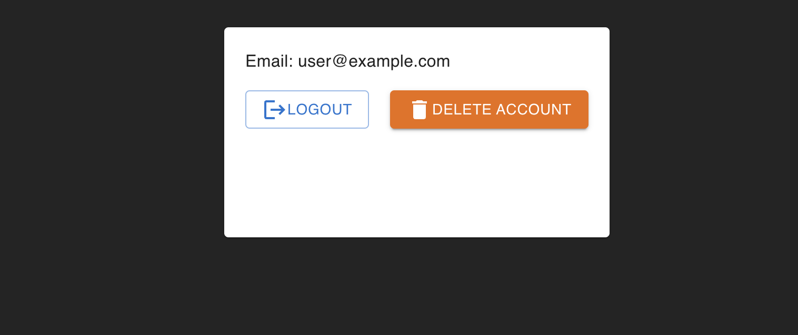

# AWS-Instance-toggle-manager
This is an web app which helps you to toggle the state of AWS EC2 instance machine.

## Login Page

## Add Instance With ID

## Update Instance State

## Delete OR Logout Account Page
